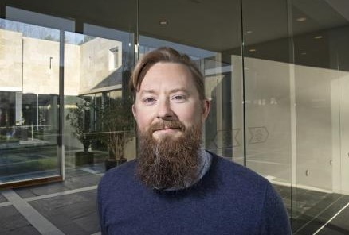

I am a tech policy expert specializing in cybersecurity, privacy, and digital identity. I'm an **Assistant Professor** of Media Studies and Data Science (joint appointment) at the **University of Virginia** (UVA). At UVA, I teach courses on data ethics, technology regulation, and media policy.

My research interests include **data governance** in development and humanitarian contexts, cyber policy, critical infrastructure protection, surveillance, and biometrics. I am particularly interested in exploring these topics across the Global South.

My most recent **publications** include a chapter on 'connectivity as aid' with the UN Refugee Agency's John Warnes for the [Handbook on Data Protection in Humanitarian Action (Cambridge University Press)](https://www.cambridge.org/core/books/handbook-on-data-protection-in-humanitarian-action/025CE3DFD1FAD908DD1412C20E49F955) and a [collaborative forum](https://doi.org/10.1080/14650045.2022.2047468) on digitization and sovereignty in humanitarian space, a [short piece](https://doi.org/10.24908/ss.v19i1.14547).

Prior to joining UVA, I was based at Maastricht University's European Centre on Privacy and Cybersecurity; from 2018-2023, I was a Postdoctoral Research Fellow on the European Research Council-funded Global Data Justice project at the Tilburg Institute for Law, Technology, and Society in the Netherlands. Before returning to academia, I developed a tech policy **career**. I was a Vice President of Cyber Policy at JPMorgan Chase in New York from 2015-2018. Before that I worked in tech policy roles at the Organisation for Economic Cooperation and Development (OECD), European Commission's Joint Research Centre, Vodafone Group, and [elsewhere](http://sixfouronea.net/professional-history/). I have lectured internationally including at the London School of Economics and Political Science (LSE), Cornell Tech, NYU Stern, and Fundação Getulio Vargas.

In recent years I have **advised** the UN Refugee Agency on digital connectivity topics, the GSMA Mobile for Development initiative on its data ethics strategy, and the World Bank on data governance in foundational identity programs. I have also led an international project on data protection regulatory convergence for the European Commission. 

I have a **PhD** in Information Systems and Innovation from the LSE, where I studied biometrics.

  

